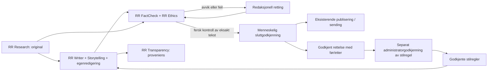

# AI-journalist 2.0 – integrert Robåt-arkitektur

Versjon 2.0.0 / Stylebook 1.1.0. Implementert for Studios eksisterende RSS-nyhetssaker i Nyhetsdesk, Kontrollsenter/Sak og Sending. PHP/Composer, sendeliste, låsing, revisjoner, roller, CSRF og manuell sluttgodkjenning gjenbrukes.

| Funksjon | Ansvar og faktisk implementasjon | Resultat / sperre |
| --- | --- | --- |
| RR Research | `studio_news_source`: avgrenset originalhenting, kildeidentitet og tekstuttrekk | Urørt tekst, URL, SHA-256 og hentetid; utilgjengelig/feil kilde stopper |
| RR Writer | `studio_web_prepare` / `studio_news_prepare` med eksisterende modeller og begrenset output | Nettutkast eller radiomanus; aldri godkjenning |
| RR Storytelling | Faste RR-S01/S02/L02 i `rr_writer_instructions` | Kildestøttet vinkel, rekkefølge, ingen fylltekst eller konstruerte scener |
| RR Editor | Skriverens egen språkvask, eksisterende manuell redigering og separat språk-/kildekontroll | Redaktør kan rette; lagring opphever kontroll/godkjenning |
| RR FactCheck | `studio_news_review`, eget modellkall uten læringsregler | Samtlige segmenter med serveroppslått kildebelegg; usikkerhet eller feil stopper |
| RR Ethics | `rr_review_instructions` i samme uavhengige kontrollpass | Konkrete etiske hindringer i `issues` stopper klar-status, også med faktabelegg |
| RR Audio | `audio-workflow`, `audio-processing`, eksisterende Sak og sendeliste | Separate manusvarianter, manuell manus- og lydgodkjenning, privat lydlager, TTS- og sendesperrer |
| RR Transparency | `rr_generation_record`, kontrollmetadata, sakshistorikk og `studio_web_html` | Versjon/modell/kildespor, synlig KI-merke og originalkreditering |

Rollene er funksjonsansvar, ikke sju autonome agenter eller sju API-kall. Ett nytt utkast bruker normalt to modellkall: skriving med egenkontroll, deretter uavhengig kilde-/språk-/etikkontroll. Det menneskelige redaktøransvaret ligger utenfor AI-rollene. Ingen nye betalte automatiske omforsøk.

## Data og kontroll

`web.generation` lagrer versjon, modell, kildehash, kildetid og regeløyeblikksbilde. `web.generatedOriginal` lagrer siste AI-original; tidligere genereringer ligger i eksisterende historikk. Radio beholder `generatedOriginal` og `generation`, med `generation.journalist` for ny proveniens. Ny kontroll lagrer policy og de faktisk utførte kontrollansvarene.

Godkjenningshash for nye KI-merkede nettsaker omfatter merkingen. Å fjerne merket endrer godkjenningshash. Eldre leveringshasher uten genereringsmetadata bevares byte-for-byte i samme kontrakt. Ingen automatisk ettermerking eller omskriving av publisert materiale. Kontrollpolicy oppgraderes til `radio-news-3-stylebook-1`: eksisterende beståtte kontroller må fornyes før ny godkjenning, mens historisk leveringsstatus beholdes.

## Redaksjonell læring

Avhengighet PR #51 gjenbruker samme læringsregister i nett og radio. Denne utvidelsen gir eksisterende forslagsskjema valg mellom radio og nett. Et rettelseseksempel krever riktig program, uendret revisjon, AI-original som faktisk er rettet, gjeldende kildekontroll og eksisterende manuell godkjenning. Før/etter, kildeøyeblikksbilde og godkjenner lagres. For eldre radio uten automatisk originalkontroll bevares eksisterende manuell verifiseringsflyt; dette er ikke automatisk originalverifikasjon.

Artikkelgodkjenning aktiverer ikke en regel. Administrator må godkjenne språkregelen separat. Inntil 20 aktive regler, status/revisjon og deaktivering gjenbrukes. Bare regeltekst/id/versjon sendes til skriveren. Gamle artikkelfakta og eksempler sendes ikke videre. Faktakontrolløren mottar aldri læringskonteksten. Regler kan påvirke formuleringen, men kan ikke endre kodesperrer eller kontrollpolicy. Dette er redaksjonell hukommelse, ikke finjustering av modellen eller selvendring av kode.

## Tester og begrensninger

`php tests/run.php` inkluderer alle nye `tests/recovered/test-journalist*.php` sammen med eksisterende HTTP-, rolle-, CSRF-, revisjons-, kilde-, publiserings- og pakketester. Tester injiserer modellsvar og måler kontrakt/sperrer, ikke faktisk feilrate i en språkmodell. Se `COMPARISON.md` for sammenligning av publisert tekst og nye redaksjonelle forslag.

Stylebook er fast kode. Fritekstråd er underordnet kildekrav i genereringsinstruksen, men instruksjoner alene garanterer ikke modellatferd. Uavhengig kontroll og menneskelig lesing beholdes. Kildebelegg garanterer ikke kildens sannhet. Systemet kontakter ikke parter, innhenter ikke samtidig imøtegåelse, søker ikke fritt på nettet og tar ikke etiske avgjørelser på redaktørens vegne.

WordPress-fotballrobotens NFF-data, spillerlæring og faktagater er ikke endret. Nyhetsdesk viser fortsatt fotballsaker via eksisterende bro. Stylebook kan brukes redaksjonelt også der, men denne PR-en injiserer ikke nye prompter i WordPress-pluginen. Vær, TTS, playout, Render og den separate TypeScript-Robot-importøren er ikke endret. Ingen ny server eller modellleverandør.

## Validering 08.10.2026

Full `php tests/run.php` bestått lokalt på PHP 8.4.25, inkludert pakking. Eksisterende vendor ble gjenbrukt etter byteidentisk `composer.lock`; ingen avhengighetsendring. JavaScript-test av saksflyt og shell-test av fullpakke-deploysperre bestått. Playwright bestått for Nyhetsdesk på 375/390/800/1280 px og læringssiden på 390/1280 px, inkludert valg av godkjent nettrettelse og lesertilgang. Mobilskjermbilde er visuelt kontrollert. Ingen fysisk iPhone eller produksjonsinnlogging testet. CI på PHP 8.2/8.4 kjøres på PR-head; lokal testing erstatter ikke den.

## RR Audio – utvidelse i samme utviklingsløp

Se [implementeringsplan og verifikasjon](RR-AUDIO.md) og [Stylebook 1.1.0](STYLEBOOK-1.1.0.md). RR Audio tar originalsnapshot fra den eksisterende saken, bruker samme faktakontroll og skriveråd, og lagrer varianter på det eksisterende sendelistepunktet. Ingen ny publiseringskø, separat robot eller parallell programdatabase.
